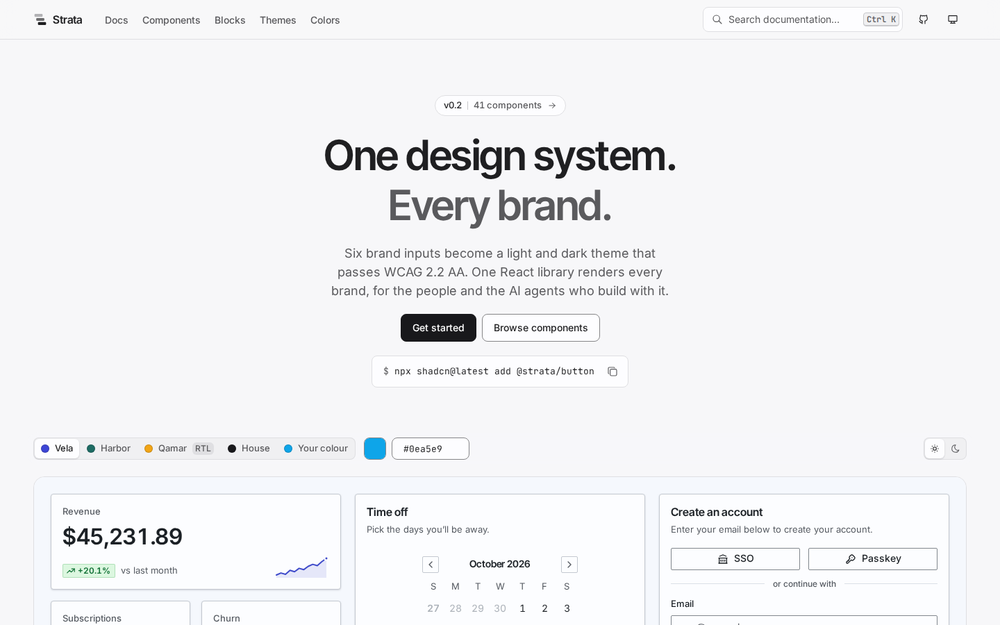
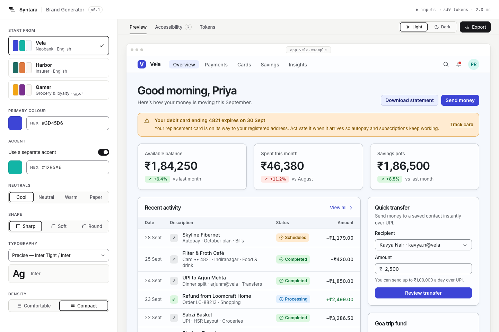
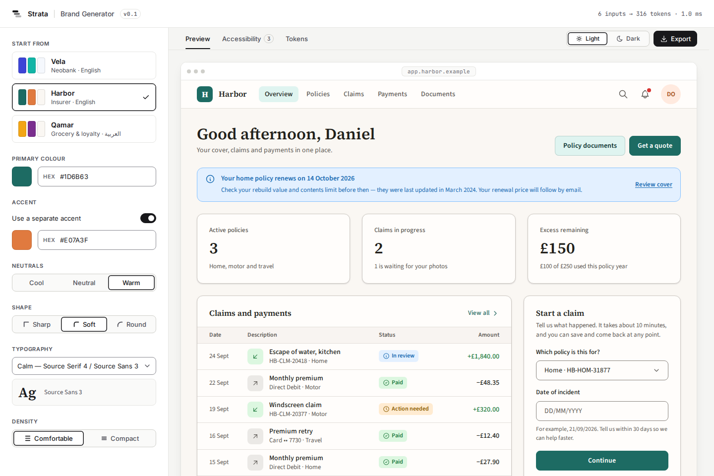
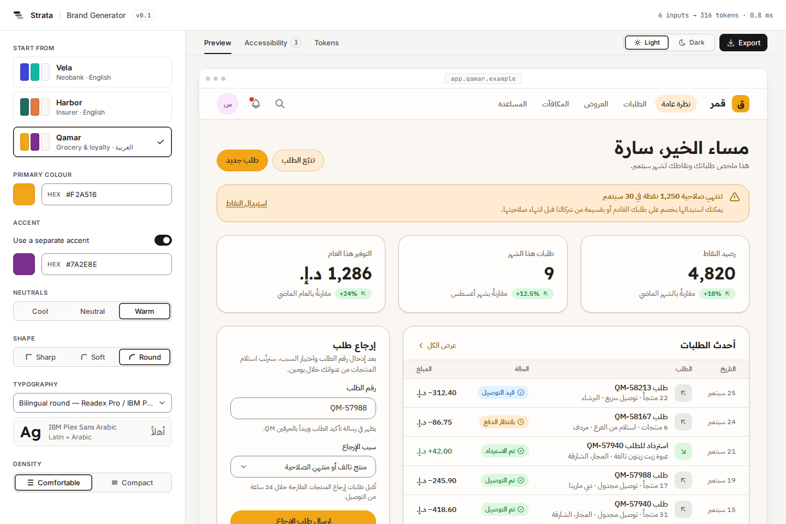

# Strata

A multi-brand design system that humans and AI agents build with.

41 React Aria components, a docs site at the level of ui.shadcn.com, and a shadcn-compatible registry, all themed by an engine that turns six brand inputs into a light and dark theme passing WCAG 2.2 AA.



| Vela · neobank | Harbor · insurer | Qamar · grocery, Arabic RTL |
|---|---|---|
|  |  |  |

Same components, same code. A tenant differs by tokens + copy only. Screenshots: `pnpm screenshots`.

## What works today (v0.2)

- **41 components** (`@strata/react`) on React Aria: fields, pickers, overlays, feedback, navigation and a DataTable. Every one works in light and dark, both densities, and RTL, and each has a `meta.json` that drives its docs page and registry item.
- **Docs site** (`apps/docs`, Next.js): component pages with live previews per tenant, scheme, direction and density; Blocks; Themes; Colors; ⌘K search. The site is themed by Strata itself.
- **Two ways to ship from one source** (ADR-011): the npm package, or `npx shadcn@latest add @strata/<name>` (verified with shadcn CLI 4.21). A theme bridge re-skins any existing shadcn project.
- **5 blocks**: dashboard, request flow, settings, sign-in and activity table. Each runs in all three tenants and installs from the registry.

Phase 1:

- **Brand Generator** — 6 inputs (primary, accent, neutral temperature, shape, type pair, density) → full theme, live preview, export. Runs in the browser.
- **OKLCH theme engine + contrast solver** — 12-step ramps, brand hex kept exact, every failing pair fixed and explained in plain English. Zero runtime dependencies.
- **Three tenants** — Vela, Harbor, Qamar. A tenant is one `brand.json` + one `content.json`.
- **Exports** — CSS variables, DTCG 2025.10 JSON, Figma-variables JSON (Brand / Scheme / Density collections).

## Numbers

Every number comes from a script. Run the command to reproduce it.

<!-- numbers:start -->
| Metric | Value | Reproduce |
|---|---|---|
| Themes fuzzed (random brands × light/dark) | 1,000 | `pnpm test:themes` |
| Contrast checks passed | 86,000 / 86,000 (100%) | `pnpm test:themes` |
| Solver adjustments per brand | median 4, max 6 (all brand-driven) | `pnpm test:themes` |
| Median theme generation time | 0.45 ms (this machine) | `pnpm test:themes` |
| Components / blocks | 41 / 5 | `pnpm check:meta`, `pnpm registry` |
| Component + engine tests | 271 + 157 passing | `pnpm test` |
| Registry items (shadcn schema-valid) | 55 | `pnpm registry` |
| Docs routes swept with axe (light + dark) | 73 × 2, 0 violations | `node scripts/axe-sweep.mjs` (with the docs site running) |
| Tenants rendering from one codebase | 3 (one Arabic RTL) + house | `pnpm tokens` |
<!-- numbers:end -->

## Quick start

Node 22 and pnpm 10 (`corepack enable`).

```sh
pnpm i
pnpm docs           # docs site → http://localhost:3000 (components, blocks, themes)
pnpm dev            # Brand Generator → http://localhost:5173
pnpm test           # unit tests
pnpm test:themes    # fuzz random brand colours × light/dark, write a pass-rate report
pnpm tokens         # build every tenant's tokens into packages/tokens
pnpm screenshots    # Playwright: every tenant × scheme + axe report
```

## Repo map

```
apps/generator/          Brand Generator (Vite + React)
packages/theme-engine/   brand inputs → theme: OKLCH ramps, contrast solver, exporters
packages/tokens/         built tokens for every tenant: CSS, DTCG, Figma
tenants/<name>/          brand.json + content.json — a brand is data, not code
docs/adr/                architecture decisions, each with who made the call
docs/log.md              session log: changed / decided / next
scripts/screenshots.mjs  Playwright screenshots + axe
```

Coming: `packages/react`, `packages/meta`, `apps/storybook` (Phase 2) · `apps/reference` (Phase 3) · `GOVERNANCE.md`, codemods (Phase 4) · `packages/mcp`, `packages/audit`, `AGENTS.md`, `evals/` (Phase 5) · `apps/docs` + `/story` (Phase 6).

## Roadmap

- [ ] **0 · Plan** — scaffold, ADR drafts *(in progress)*
- [ ] **1 · Tokens + engine + generator v0** — tiers, 3 tenants, contrast solver + fuzz, one preview screen *(in progress)*
- [ ] **2 · Components** — ~20 components, meta, a11y, RTL, density, Storybook, visual tests
- [ ] **3 · Reference product** — 3 screens × 3 tenants, Qamar in Arabic RTL
- [ ] **4 · Governance** — GOVERNANCE, RFC flow, Changesets, one real deprecation + codemod
- [ ] **5 · MCP + audit + eval** — MCP server, drift auditor, CI gate, agent eval A vs B
- [ ] **6 · Publish** — npm, docs site, `/story` page

## Principles

1. **Tokens are the API.** Components use semantic/component tokens, never primitives.
2. **A brand is data, not code.** New tenant = one JSON file. Zero component changes.
3. **Accessible by construction.** A theme that fails WCAG 2.2 AA can't be generated or exported.
4. **Logical properties only.** RTL is free, not a retrofit.
5. **Design ↔ code parity.** Every Figma property maps 1:1 to a React prop.
6. **One source of truth for humans and agents.** Docs, MCP and Figma read one `meta.json`.
7. **Make the right thing the easy thing.** Every finding suggests the exact fix.

## Built by

Designed by **Anuj Patel**. Engineering paired with Claude (AI); every decision is recorded in [`docs/adr`](docs/adr) with who made it.

## License

[MIT](LICENSE)
