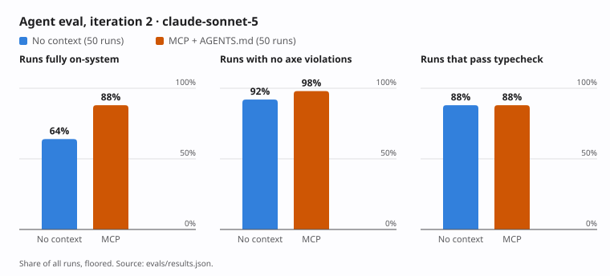

# Agent eval results

Generated by `node evals/report.mjs --iteration 2` from the scored runs in `evals/runs/iter-2/`. Do not edit by hand. The method, and how to reproduce it, is in [README.md](README.md).

- **Iteration:** 2
- **Runs scored:** 100
- **Models:** `claude-sonnet-5`
- **Conditions:** No context, MCP + AGENTS.md
- **Packages packed from:** `dffb1e0`, a fresh checkout with nothing uncommitted

Rates are out of all runs, so a screen that was never built counts against its condition. Medians of the audit score are over the screens that were built. Scores and rates are floored, never rounded up.

## claude-sonnet-5

| Measure | No context | MCP + AGENTS.md |
|---|---|---|
| Runs | 50 | 50 |
| Runs the agent didn’t finish (error or timeout) | 1 | 0 |
| Runs that read outside their workspace (kept in the numbers, listed below) | 0 | 0 |
| Screens built | 50 | 50 |
| Screens that import from @strata/react | 50 | 50 |
| Runs that read the installed packages | 50 | 37 |
| Median audit score (0–100) | 100 | 100 |
| Lowest / highest audit score | 91.6 / 100 | 100 / 100 |
| Fully on-system, % of runs | 64 | 88 |
| Renders in every view, % of runs | 98 | 98 |
| Passes typecheck, % of runs | 88 | 88 |
| No axe violations, % of runs | 92 | 98 |
| Axe violation nodes per built screen, mean | 0.1 | 0 |
| No horizontal scroll at 390px, % of runs | 98 | 92 |
| No brand names in code, % of runs | 100 | 100 |
| Median turns | 57 | 33.5 |
| Median output tokens | 20215 | 14653 |
| Median cost per run, USD (as the CLI reports it) | 0.85 | 0.513 |
| Median wall time, seconds | 255 | 168 |

### By tag

**a11y**

| Measure | No context | MCP + AGENTS.md |
|---|---|---|
| Runs | 30 | 30 |
| Runs the agent didn’t finish (error or timeout) | 0 | 0 |
| Runs that read outside their workspace (kept in the numbers, listed below) | 0 | 0 |
| Screens built | 30 | 30 |
| Screens that import from @strata/react | 30 | 30 |
| Runs that read the installed packages | 30 | 19 |
| Median audit score (0–100) | 100 | 100 |
| Lowest / highest audit score | 91.6 / 100 | 100 / 100 |
| Fully on-system, % of runs | 63.3 | 93.3 |
| Renders in every view, % of runs | 100 | 100 |
| Passes typecheck, % of runs | 86.6 | 93.3 |
| No axe violations, % of runs | 93.3 | 100 |
| Axe violation nodes per built screen, mean | 0.1 | 0 |
| No horizontal scroll at 390px, % of runs | 100 | 93.3 |
| No brand names in code, % of runs | 100 | 100 |
| Median turns | 58 | 30 |
| Median output tokens | 20217 | 12568 |
| Median cost per run, USD (as the CLI reports it) | 0.882 | 0.463 |
| Median wall time, seconds | 255 | 143 |

**multi-brand**

| Measure | No context | MCP + AGENTS.md |
|---|---|---|
| Runs | 16 | 16 |
| Runs the agent didn’t finish (error or timeout) | 1 | 0 |
| Runs that read outside their workspace (kept in the numbers, listed below) | 0 | 0 |
| Screens built | 16 | 16 |
| Screens that import from @strata/react | 16 | 16 |
| Runs that read the installed packages | 16 | 14 |
| Median audit score (0–100) | 100 | 100 |
| Lowest / highest audit score | 98.5 / 100 | 100 / 100 |
| Fully on-system, % of runs | 81.2 | 75 |
| Renders in every view, % of runs | 93.7 | 93.7 |
| Passes typecheck, % of runs | 87.5 | 75 |
| No axe violations, % of runs | 87.5 | 93.7 |
| Axe violation nodes per built screen, mean | 0.13 | 0 |
| No horizontal scroll at 390px, % of runs | 93.7 | 93.7 |
| No brand names in code, % of runs | 100 | 100 |
| Median turns | 46 | 37 |
| Median output tokens | 18312 | 15559 |
| Median cost per run, USD (as the CLI reports it) | 0.844 | 0.551 |
| Median wall time, seconds | 231 | 193 |

**rtl**

| Measure | No context | MCP + AGENTS.md |
|---|---|---|
| Runs | 12 | 12 |
| Runs the agent didn’t finish (error or timeout) | 0 | 0 |
| Runs that read outside their workspace (kept in the numbers, listed below) | 0 | 0 |
| Screens built | 12 | 12 |
| Screens that import from @strata/react | 12 | 12 |
| Runs that read the installed packages | 12 | 8 |
| Median audit score (0–100) | 99.5 | 100 |
| Lowest / highest audit score | 91.6 / 100 | 100 / 100 |
| Fully on-system, % of runs | 41.6 | 83.3 |
| Renders in every view, % of runs | 91.6 | 91.6 |
| Passes typecheck, % of runs | 91.6 | 83.3 |
| No axe violations, % of runs | 83.3 | 91.6 |
| Axe violation nodes per built screen, mean | 0.09 | 0 |
| No horizontal scroll at 390px, % of runs | 91.6 | 83.3 |
| No brand names in code, % of runs | 100 | 100 |
| Median turns | 59.5 | 36 |
| Median output tokens | 20257.5 | 17288 |
| Median cost per run, USD (as the CLI reports it) | 0.842 | 0.535 |
| Median wall time, seconds | 254 | 198 |

### How much repeats disagree

The same prompt, condition and model, run more than once. A large range means a single run says little.

| Measure | No context | MCP + AGENTS.md |
|---|---|---|
| Prompts | 25 | 25 |
| Audit score range between repeats, median | 0 | 0 |
| Audit score range between repeats, largest | 4.3 | 0 |
| Prompts where repeats disagreed on "fully on-system" | 10 | 6 |

### Findings by rule

| Rule | No context | MCP + AGENTS.md |
|---|---|---|
| `missing-accessible-name` | 2 | 0 |
| `native-element` | 3 | 0 |
| `off-scale-font-size` | 1 | 0 |
| `off-scale-space` | 4 | 0 |
| `physical-property` | 6 | 0 |
| `raw-color` | 1 | 0 |
| `raw-font-weight` | 2 | 0 |

## Notes on this iteration

From `runs/iter-2/NOTES.md`, written by hand.

**How to read the numbers**

- 50 runs per condition, one model, one agent. A gap of a few points is inside what repeats of the same prompt disagree on. Repeats disagreed on "fully on-system" for 10 of 25 prompts without context and 6 of 25 with the server.
- "Fully on-system" is strict: no audit findings, no type errors, renders in every view, no brand names. One type error fails it.
- The median audit score is 100 in both conditions, so it doesn't tell them apart. The counts of findings do: 19 without context, 0 with the server.
- Both conditions used Strata. All 100 screens import from `@strata/react`.
- Runs with the server took fewer turns and cost less as the CLI reports it. 13 of those 50 never opened the installed packages.

**Where the server did worse**

- Horizontal scroll at 390px: 3 screens with the server, none without. The rate in the table also counts screens that couldn't be measured because they didn't build: 1 in each condition.
- `multi-brand` prompts: 75% fully on-system with the server, 81.2% without. 16 runs each, so that's 12 against 13.
- Type errors are level at 88%. With the server they come from guessing at types the server doesn't describe: React Aria's `Key`, a column's cell function, `IconTile`'s tint.
- Both conditions imported an icon that doesn't exist, once each. The server has no tool to look up icons.

**What happened during the run**

- The account's usage limit was reached part-way. 84 runs ended in seconds with the limit message and 3 were cut off mid-work. All 87 were thrown away and run again. `run.mjs` now stops at a limit and records nothing for the runs it cuts short.
- The first 47 runs ran 3 at a time and the rest 8 at a time. Runs are independent, but a busier machine makes each one slower.
- One run without context hit the 15-minute limit (`18-payment-schedule`, repeat 2), while 8 were running at once. It counts as a run the agent didn't finish. Another took 796 seconds and finished.
- The first report listed 5 runs as reading outside their workspace. All 5 were the recorder's mistakes: files that don't exist inside the workspace, the folder above it, and Claude Code's own store for a long tool result. `score.mjs` now tells these apart. No run read another run's files or this repo.

**Setup**

- Packages packed from `dffb1e0`, a fresh checkout. Iteration 1 used `320a45c`; it isn't comparable for other reasons (see `runs/iter-1/INVALID.md`).
- Runs on 2026-09-27 and 2026-09-28, model `claude-sonnet-5`, Claude Code 2.1.283.
- Cost as the CLI reports it, summed over the 100 runs that count: 45.71 USD without context, 28.25 USD with the server.

## Runs that failed or leaked

No run read a file outside its workspace and the installed packages.

| Prompt | Condition | Model | Repeat | What happened |
|---|---|---|---|---|
| 09-loyalty-points-rtl | No context | `claude-sonnet-5` | 2 | the app didn’t build |
| 18-payment-schedule | No context | `claude-sonnet-5` | 2 | agent error (no result event) |
| 23-activity-timeline | MCP + AGENTS.md | `claude-sonnet-5` | 1 | the app didn’t build |
